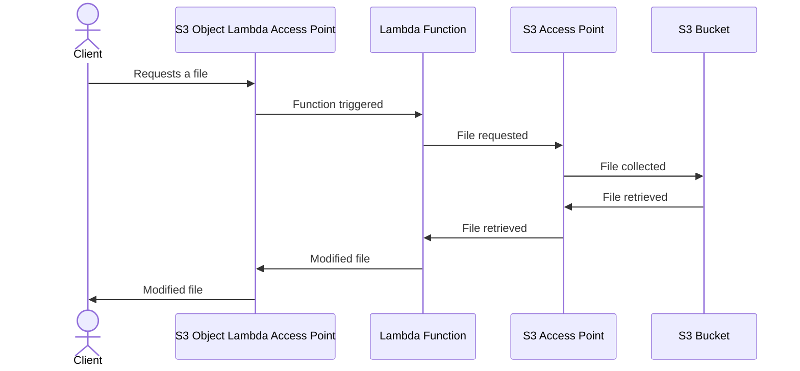

# S3 - Simple Storage Service

## General

- The bucket's name must be unique globally. The buckets are created in a specific AWS region though.
- Each file can have a maximum of 5GB (5000MB). However, it is possible to upload bigger files by using the multi-part upload (it has to be enabled in the PUT request).
- IAM Principal can access an S3 object if:
    - IAM Policy (User policy or Role Policy(AWS Services)) allow
    - **OR** Resource Policy (Bucket Policy) allow
    - **AND** there's no explicit denial in the action

## Storage Classes

|                                    |       S3 Standard      | S3 Intelligent-Tiering* |     S3 Standard-IA     |     S3 One Zone-IA†    | S3 Glacier Instant Retrieval | S3 Glacier Flexible Retrieval | S3 Glacier Deep Archive |
|:----------------------------------:|:----------------------:|:-----------------------:|:----------------------:|:----------------------:|:----------------------------:|:-----------------------------:|:-----------------------:|
| Designed for durability            | 99.999999999% (11 9’s) |  99.999999999% (11 9’s) | 99.999999999% (11 9’s) | 99.999999999% (11 9’s) |    99.999999999% (11 9’s)    |     99.999999999% (11 9’s)    |  99.999999999% (11 9’s) |
| Designed for availability          |         99.99%         |          99.9%          |          99.9%         |          99.5%         |             99.9%            |             99.99%            |          99.99%         |
| Availability SLA                   |          99.9%         |           99%           |           99%          |           99%          |              99%             |             99.9%             |          99.9%          |
| Availability Zones                 |           ≥3           |            ≥3           |           ≥3           |            1           |              ≥3              |               ≥3              |            ≥3           |
| Minimum capacity charge per object |           N/A          |           N/A           |         128 KB         |         128 KB         |            128 KB            |              N/A              |           N/A           |
| Minimum storage duration charge    |           N/A          |           N/A           |         30 days        |         30 days        |            90 days           |            90 days            |         180 days        |
| Retrieval charge                   |           N/A          |           N/A           |    per GB retrieved    |    per GB retrieved    |       per GB retrieved       |        per GB retrieved       |     per GB retrieved    |
| First byte latency                 |      milliseconds      |       milliseconds      |      milliseconds      |      milliseconds      |         milliseconds         |        minutes or hours       |          hours          |

## S3 Versioning

- When enabled, files already in the bucket will have their version set as **null**.
- Stopping the versioning will not delete the file's versions. It is a safe operation.

## S3 Replication

- Replication can be on the same region or cross-region.
- Needs versioning enabled in both buckets and needs the proper IAM permissions.
- Only new objects are replicated, and the version ID will be the same for the original and the replicated file.
- For objects created before the replication started, it is possible to use S3 Batch Replication to replicate them.
- Delete markers can also be replicated (optionally).
- Files with version ID, when deleted, are not deleted from the replication bucket to avoid malicious attacks.
- **THERE IS NO CHAINING OF REPLICATION!** Bucket1 -> Bucket2 -> Bucket3 is not possible!!

## S3 Lifecycle

- Lifecycle's actions/transitions can be applied to both current and/or non-current versions of the files.

## S3 Lifecycle Analytics

- Generates a daily report to help decide when to transition objects to the best storage class. Works on Standard and Standard IA (Infrequent access) files. **DOES NOT** work on One-Zone IA of Glacier.

## S3 Event Notification

- **Possible targets are SNS, SQS, Lambda, and EventBridge.** EventBridge allows integration with more than 18 AWS services, advanced filtering options with JSON rules, multiple AWS destinations, and has the following capabilities: archive, replay, etc.

## S3 Performance

- **Requests throttling is done by FILE PREFIX.** Max of 3500 PUT\COPY\POST\DELETE or 5000 GET\HEAD per second per file prefix.
- Multi-part upload is recommended for files above 100MB and a must for files over 5GB.

### S3 Transfer Acceleration 

- Increases the speed of file transfers by using Edge Locations as a bridge to the target bucket. File arrives in the Edge Location via public www, and from the Edge Location to the bucket, it uses a private AWS network.

### S3 Byte-Range Fetches

- Used to speed up downloads by parallelizing GETs. Better resilience in case of failures: can retry only the failed range. 
- It is also useful for partial data retrieval.

## S3 Select & Glacier Select

- Server-side filtering with SQL. There are fewer network and CPU costs on the client side.

## S3 Encryption

The types of encryption are:

### Bucket Encryption

#### SSE-S3

- It is the default method of encryption for every bucket. 
- PUT requests must have the header "x-amz-server-side-encryption:"AES256"

#### SSE-KMS

- Better security and user control, as encryption keys can be rotated. Allows some audit capabilities by checking who and when have used the KMS key.
- **S3 requests may be throttled by the KMS quotas** (it can be increased via request)
- PUT requests must have the header "x-amz-server-side-encryption:"aws:kms"

#### DSSE-KMS

- Pretty much the same as SSE-KMS, but with an additional layer of encryption. "D" stands for Double.

#### SSE-C

- HTTPS must be used
- Each file must be sent with its corresponding encryption key. File is then encrypted by AWS and the key is deleted. **AWS does not store the key**, which means if the customer loses it, it won't be able to decrypt the file.

#### Client-side encryption

- This is only possible via CLI. Not possible via AWS Console.

### In-flight encryption

- Usually referred as **SSL\TLS**.
- S3 HTTP endpoint is not encrypted in-fligth. S3 HTTPS endpoint is. HTTPS is always recommended over HTTP.
- Encryption in-flight may be forced by using a Deny GetObject bucket policy when the condition "aws:secureTransport":"false" is true.

## S3 Access Points

- Grants access to specified Bucket prefixes. Good for restricting access via URL.
- Policies attached to the Access Point.
- Each access point will have its own DNS. It can allow public origin or VPC origin. For VPC origin, it will need a VPC endpoint connected to the S3 Access Point.

## S3 Object Lambda

- Used to run a lambda function on a file before its retrieval. Requires a supporting S3 Access Point.
- Use cases:
    - Redacting files (PII, for example)
    - Converting files
    - Resizing and watermarking images depending on the user who requested the files.

Example:

