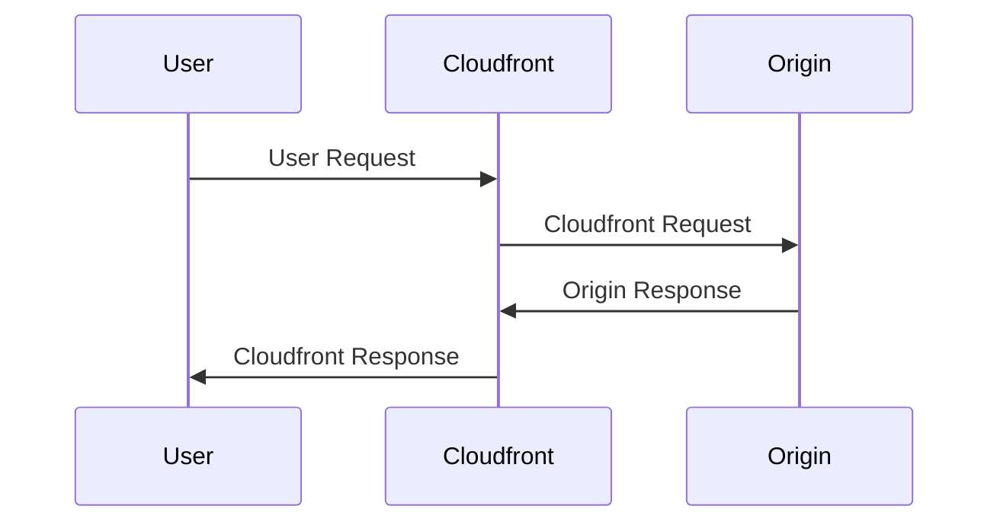

# AWS Lambda
{: .no_toc }

  

    Table of contents
  

  {: .text-delta }
- TOC
{:toc}

---

## General

AWS Lambda is a serverless, highly-available (no scheduled maintenance), event-driven compute service that lets you run code in any programming language for virtually any type of application, backend service, or for integrating different AWS services. They execute on-demand and are charged by the millisecond.

Multiple instances of the same function can run simultaneously, but each of them can run for up to 15 minutes.

They can have from 128MB up to 10GB of RAM. The RAM size has a direct relation with CPU and Network resources: more RAM equals better performance.

[EFS disks](/docs/services/storage/efs.html) can be attached to the lambda functions.

## Main integrations

- API Gateway: for rest APIs;
- Kinesis: for real-time data processing;
- DynamoDB: for real-time event reaction. For example, sending a welcome message when a new user is added to the database. DynamoDB can also be used for *stateful* applications;
- S3: with bucket notifications. For example, for removing PII data;
- Cloudfront: [Lambda@Edge](#lambdaedge);
- Cloudwatch Events: actions triggered by Cloudwatch alarms or triggered based on a schedule using *CRON*-like specification.
- SNS and SQS: to react to notifications;
- Cognito: to authenticate users.

## Lambda Limits

- From 128 MB up to 10 GB of memory;
- Execution time of up to 15 minutes;
- Max of 4KB of environment variables;
- 512MB available for temporary storage on the *./tmp* directory, which can also be used for initialization files;
- Up to 1.000 concurrent executions (can be increased via Support request);
- Code must have up to 50MB in a *.zip* file format. Unzipped, it can have up to 250MB;

## Permissions

- **User policies**: defines if a user can run the function or not;
- **Execution Role**: a Lambda policy specifying which AWS services/resources the function is allowed to interact with. The default role gives access to publish to the Cloudwatch logs.
- **Resource-based policies**: allow other services to execute the Lambda function.

## Anti-patterns

- Long processes;
- Dynamic websites;
- Stateful Applications.

## Storage options

|                                          | Ephemeral Storage /tmp       | Lambda Layers                                    | Amazon S3                          | Amazon EFS                                    |
| ------------------------------------ | ---------------------------- | ------------------------------------------------ | ---------------------------------- | --------------------------------------------- |
| **Max. Size**                            | 10GB / 512MB for temp folder | up to 5 layers per function for a total of 250MB | Elastic                            | Elastic                                       |
| **Persistence**                          | Ephemeral                    | Durable                                          | Durable                            | Durable                                       |
| **Content**                              | Dynamic                      | Static                                           | Dynamic                            | Dynamic                                       |
| **Storage Type**                         | File System                  | Archive                                          | Object                             | File System                                   |
| **Pricing**                              | Included                     | Included                                         | Storage + Requests + Data Transfer | Storage + Data Transfer + Throughput          |
| **Permissions**                          | N/A  (Function only)         | IAM                                              | IAM                                | IAM + NFS                                     |
| **Shared Across Concurrent Invocations** | No                           | Yes                                              | Yes                                | Yes                                           |
| **Use cases**                            | Temporary files              | Code dependencies/libraries                      | Input files                        | Shared files across multiple lambda instances |
| **Relative Speed**                       | Fastest                      | Fastest                                          | Slowest                            | Intermediate                                  |

## Concurrency

Concurrency defines the number of simultaneous requests (Lambda Function's instances) each function supports. If the concurrency is ever set to zero or reaches the maximum limit, the Functions will not be able to handle any request.

The maximum concurrency is limited by AWS Region and this limit is shared with all Lambda Functions on that region.

The ideal concurrency for a function can be calculated by:

{: .note }
> $$
> Concurrency = (average requests per second) * (average request duration in seconds)
> $$

*This means concurrency is not the same as requests per second.*

There are two types of concurrency:

- **Reserved Concurrency**: the concurrency is reserved exclusively for a single Lambda Function (including all their versions and aliases).
This means the pool of shared concurrency will be reduced. This is useful for ensuring other functions will not block this function's executions and also that the function will not scale without control.
- **Provisioned Concurrency**: ensures the set number of instances are always active, minimizing the latency caused by cold starts. The Provisioned Concurrency cannot be bigger than the Reserved Concurrency and they are set on a version/alias level. The downside is that it incur costs even if the function is not being utilized (the instances are actice nonetheless).

It is possible to use the **Application Auto Scaling** to change the provisioned concurrency according to time/demand.

## Scaling

Lambda tries to reutilize an instance whenever it becomes idle. However, if new requests are coming while every instance is busy, a new instance will be created and every new instance will have a cold start delay:

## Invocation types

### Direct Trigger

Lambdas can be triggered via direct trigger, synchronously or asynchronously, from:

- **CLI**
- [S3](docs/services/storage/s3.html)
- [SNS](inprogress)
- [API Gateway](inprogress)

This type of trigger is recommended for **discrete events and real-time processing**.

#### Synchronous

The process that started the execution waits until the processing has completed. One event is processed per time.

Synchronous mode is triggered by the `invoke` command.

#### Asynchronous

The event is added to a queue and only the status of this action is returned. The process which triggered the execution do not receive the return of the function.

Several services can start an asynchronous execution, such as:

- [S3](docs/services/storage/s3.html)
- [SNS](inprogress)

In case of failure in the Lambda, by default it will retry it two more times. It is possible to configure how Lambda will handle the error, for example, by sending the events to a [SQS](inprogress) to [Event Bridge](inprogress) to another **Lambda** or to a [SNS Topic](inprogress), or by modifying the parameters `MaximumEventAgeInSeconds` and `MaximumRetryAttempts`.

For dead-letter queues, Lambda only sends the content of the event, without details about the response.

Be aware that the Lambda Async queue is eventually consistent, so the same message may be processed more than once. Therefore, it is recommended to ensure the function is idempotent.

### Event Source Mapping

It is a Lambda resource that reads items from streams or queues and process them in batches. Recommended for **processing high-volume data**. Supported services are:

- [DocumentDB](docs/database/documentdb.html) (with MongoDB compatibility)
- [DynamoDB](docs/database/dynamodb.html)
- [Kinesis](inprogress)
- [Amazon MQ](inprogress)
- [Amazon MSK](inprogress)
- [Self Managed Apache Kafka](inprogress)
- [Amazon SQS](inprogress)

Each event is processed **at least once**, so it is recommended to have an idempotent function.

It is possible to configure **MaximumBatchingWindowInSeconds** and **BatchSize** and it is also possible to filter events.

When one of this three happens, a batch is sent to the Lambda:

- The batching window reaches its maximum value;
- The batch size is met.
- The payload size reaches **6 MB**. **You cannot modify this limit**.

In case of failure, the whole batch is processed and, to ensure in-order processing, the event source mapping pauses processing for the affected shard until the error is resolved.

### Function URL

A dedicated HTTP(S) endpoint for the Lambda Function, in the form of `https://<url-id>.lambda-url.<region>.on.aws`.

It is possible to control access to the Lambda Function URL using the `AuthType` parameter and **resource-based policies**, but **Function URLs are accessible via public internet only.**

## Lambda Layers

A Lambda Layer is a package that can contain code dependencies and customized libraries, helping to reduce the deployment package and to keep a better control over what packages are being used.

Each Lambda function can have a maximum of 5 layers attached to them, and they are loaded under `/opt`.

## Network

When a function is connected to a VPC, the service will create a [ENI](docs/glossary.html) for each Security Group/Subnet in the VPC. This process can take a couple of minutes, during which the function cannot be changed.

If the ENI stays idle for too long, it will be removed from the function and a new one will be created when the function is called again. This means the function will probably fail while the ENI is being recreated.

Each ENI can be attached to multiple Lambda Functions.

## Lambda + SQS

Supports Standard or FIFO Queues, but the messages are ordered only on FIFO queues, by `Message Group ID`.

## Lambda + Kinesis

When integrated with Kinesis, the function receives a batch of records as an event. The records are processed synchronously, one by one. The batch size is configurable to up to 10.000 records, but you need to be aware of the function time limit to avoid timeouts. Additionally, if the batch is greater than 6MB, then it will be automatically split into smaller batches.

The Lambda function will automatically retry any failed batch until it succeeds or the data expires. If the errors are not handled properly, it may block the Kinesis Shard, which expects a response from the Lambda function.

## Lambda@Edge

Lambda@Egde allows the deployment of Lambda function with the *Cloudfront CDN*, on the Edge Locations, for:

- More responsive apps;
- *CDN* customization.

It is possible to execute the Lambda function at four distinct stages:

1. User Request;
2. Cloudfront Request;
3. Origin Response;
4. Cloudfront Response.

It is possible to generate the User Response without sending the request to the Origin, using only User Request and Cloudfront Response.

Use cases include SEO, A/B tests, user tracking, analytics, security, etc.
