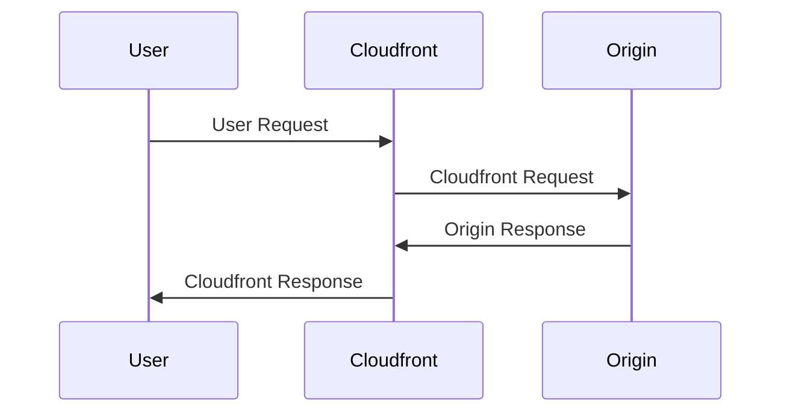

# AWS Lambda
{: .no_toc }

  

    Table of contents
  

  {: .text-delta }
- TOC
{:toc}

---

## General

AWS Lambda is a serverless, event-driven compute service that lets you run code in any programming language for virtually any type of application, backend service, or for integrating different AWS services. They execute on-demand and are charged by the millisecond.

Multiple instances of the same function can run simultaneously, but each of them can run for up to 15 minutes. 

They can have from 128MB up to 10GB of RAM. The RAM size has a direct relation with CPU and Network resources: more RAM equals better performance.

[EFS disks](https://paulohsilvapinto.github.io/aws-certify/docs/services/storage/efs.html) can be attached to the lambda functions.

## Main integrations

- API Gateway: for rest APIs;
- Kinesis: for real-time data processing;
- DynamoDB: for real-time event reaction. For example, sending a welcome message when a new user is added to the database. DynamoDB can also be used for *stateful* applications;
- S3: with bucket notifications. For example, for removing PII data;
- Cloudfront: [Lambda@Edge](#lambda@edge);
- Cloudwatch Events: actions triggered by Cloudwatch alarms or triggered based on a schedule using *CRON*-like specification.
- SNS and SQS: to react to notifications;
- Cognito: to authenticate users.

## Lambda Limits

- From 128 MB up to 10 GB of memory;
- Execution time of up to 15 minutes;
- Max of 4KB of environment variables;
- 512MB available for temporary storage on the *./tmp* directory, which can also be used for initialization files;
- Up to 1.000 concurrent executions (can be increased via Support request);
- Code must have up to 50MB in a *.zip* file format. Unzipped, it can have up to 250MB;

## Permissions

- **User policies**: defines if a user can run the function or not;
- **Execution Role**: a Lambda policy specifying which AWS services/resources the function is allowed to interact with. The default role gives access to publish to the Cloudwatch logs.
- **Resource-based policies**: allow other services to execute the Lambda function.

## Anti-patterns

- Long processes;
- Dynamic websites;
- Stateful Applications.

## Lambda + Kinesis

When integrated with Kinesis, the function receives a batch of records as an event. The records are processed synchronously, one by one. The batch size is configurable to up to 10.000 records, but you need to be aware of the function time limit to avoid timeouts. Additionally, if the batch is greater than 6MB, then it will be automatically split into smaller batches.

The Lambda function will automatically retry any failed batch until it succeeds or the data expires. If the errors are not handled properly, it may block the Kinesis Shard, which expects a response from the Lambda function. 

## Lambda@Edge

Lambda@Egde allows the deployment of Lambda function with the *Cloudfront CDN*, on the Edge Locations, for:

- More responsive apps;
- *CDN* customization.

It is possible to execute the Lambda function at four distinct stages:

1. User Request;
2. Cloudfront Request;
3. Origin Response;
4. Cloudfront Response.

It is possible to generate the User Response without sending the request to the Origin, using only User Request and Cloudfront Response.

Use cases include SEO, A/B tests, user tracking, analytics, security, etc.