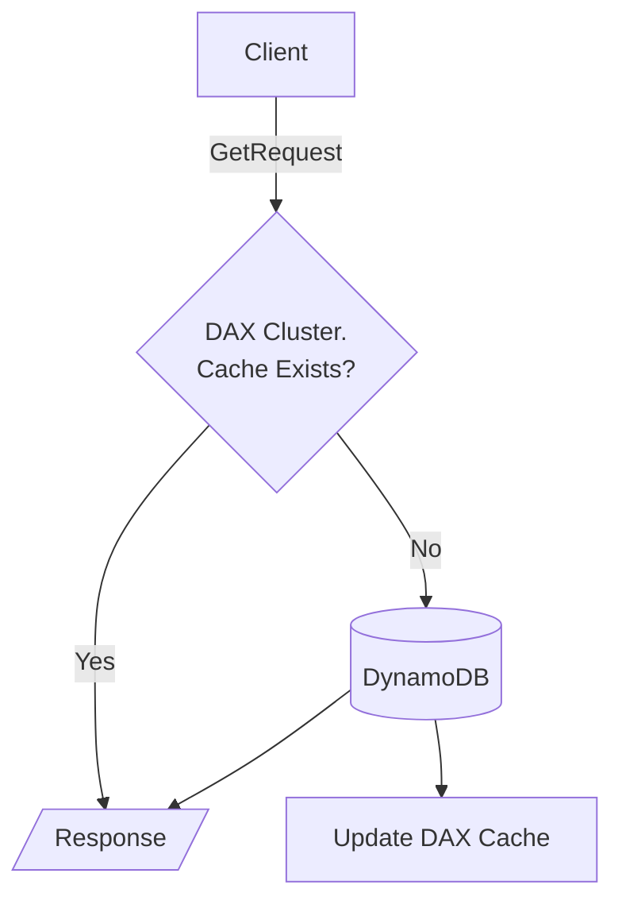

# DynamoDB
{: .no_toc }

  

    Table of contents
  

  {: .text-delta }
- TOC
{:toc}

---

## General

- NoSQL database. It is serverless, fully managed, and replicated across multi-AZs. It can handle a vast amount of data due to its distributed nature. It is a low-cost service and can adapt well to the workload with its auto-scaling capabilities.
- Limited SQL support with PartiQL which allows SELECT, INSERT, UPDATE, and DELETE. There is no support for query joins and aggregations.
- The Primary Key must be created at the table creation time. The same goes for the Sort Key; however, unlike the Primary Key, a Sort Key is not mandatory.
- Each row can have a maximum of **400KB**, and the attributes (fields) can store nested data like list, map, and set, just like a JSON record.

## Use cases

- DynamoDB is recommended for a variety of scenarios such as Mobile apps, IoT, Gaming, etc,
- **Anti-patterns** include: using for data that requires complex transactional data and SQL instructions; modifying from a relational database to a NoSQL database if the application was prepared to work with a relational DB. 
- **Large objects** cannot be stored directly on DynamoDb due to the limitation of file size, but a typical pattern is storing the data in S3 and the metadata in the DynamoDB table.
- Another useful pattern is to enable an S3 Notification event to a Lambda Function and store the S3 object's metadata in a DynamoDB table to create a Data Catalogue and index S3's metadata.

{: .note }
> In general: 
> - Large volume of data with multiple reads and write requests: DynamoDB;
> - Large volume of data, but data is not retrieved/modified frequently: S3;
> - Transactional data with complex SQL instructions: RDS.

## Primary Keys

There are two options for the primary keys, and you must choose at the table creation time:

### Partition Key (HASH Key)

- The key must uniquely identify each record, and it is used to distribute the data across the different DynamoDB partitions. It's better to have a random partition key to avoid data skewness.

### Partition Key + Sort Ket (HASH + RANGE Keys)

- The combination of both the HASH and the RANGE keys must uniquely identify each record.
- The partition key will have the same functionality as before, and the Sort key will be used to sort the records inside the partition.
- This option is best suited for scenarios where you want to store related records in the same place (same Node) so that data retrieval is faster. For example, user_id + order_id.

## Storage Tiers

Per table, can be:

- Standard
- Infrequent Access

## Read Consistency Modes

DynamoDB data is replicated across multi-AZs. The data you are trying to read, maybe is being fetched from a different node than the one the data was originally written. The data could be out-of-date in the replicated node depending on the time interval between the write and the read operations. 

Considering this scenario, there are two options for Read Consistency mode, which you can set for each GET API request:

- **Eventually Consistent Read**: You may get stale data, but it is cheaper. This is the default mode.
- **Strongly Consistent Read**: It ensures no stale data will be retrieved, but will double the RCU consumption and may introduce additional latency.

## Capacity Modes

Table capacity is defined by the RCU (Read Capacity Units) and WCU (Write Capacity Units). There are two modes for setting these variables, and it's possible to change between them once every 24 hours. They can be:

- **Provisioned**: RCU and WCU must be supplied according to the expected workload and you can optionally enable the auto-scale and set the min, max, and target percentage values for the auto-scale to operate. RCU and WCU can be exceeded momentarily. In this case, the extra consumption will come from the **Burst Capacity**. If the Burst Capacity is depleted, a *ProvisionedThroughputExceededException* will be raised. Exponential backoff is recommended to normalize the operation.
- **On-demand**: Automatically scales RCU and WCU up or down, but is more expensive than Provisioned mode. There is no throttling in this mode. Ideal for hard-to-predict workloads.

{: .important }
> RCUs and WCUs are divided evenly between all table partitions. This is an important reason for avoiding hot partitions!

### WCU (Write Capacity Units)

WCU represents one item per second for an item of up to 1 KB in size (rounded up). So the required WCU will be:

{: .note }
> $$
> WCU = ItemsPerSecond * \frac{ItemSizeKb}{1Kb}
> $$
> 
> \* Item size in KB must be rounded up.

### RCU (Read Capacity Units)

RCU represents one Strongly Consistent Read or two Eventually Consistent Reads per second for an item for up to 4KB.

{: .note }
> $$RCU_{strongly\_consistent} = ItemsPerSecond * \frac{ItemSizeKb}{4Kb}$$
> 
> $$RCU_{eventually\_consistent} = \frac{ItemsPerSecond}{2} * \frac{ItemSizeKb}{4Kb}$$
> 
> \* Item size in KB must be rounded up to the next multiple of 4. For example, if item size is 10KB we must consider it to be 12KB.

## Indexes

There are two index options in DynamoDB. Both of them allow the Attribute Projection selection, which can be *KEYS_ONLY, INCLUDE, or ALL*.
They can be used when there is a need to retrieve the data by different keys. **Remember:** *GetItem* or *Query* filters by the keys only. Any non-key attribute is filtered client-side, incurring RCU consumption.

### Local Secondary Index (LSI)

- LSIs provide an alternative sort key; the partition key will be the same as the base table (hence "Local": data stays in the same partitions as in the base table).
- Each table is allowed to have up to five LSIs, and they must be defined at the table creation time.
- Uses RCUs and WCUs of the base table. There is no provisioning for LSI.

### Global Secondary Index (GSI)

- GSIs provide an alternative Primary Key (be it HASH only or HASH + RANGE), and they can be created anytime. It is essentially a new table with shared data between them.
- RCUs and WCUs must be provisioned for the index. It does not use the same as the base table.

{: .important }
> If writes are throttled in the GSI, then the main table will also be throttled, no matter the WCU consumption in the base table, as the data has to be written to both tables mandatorily.

## Time to Live (TTL)

TTL automatically deletes items from a table and their indexes (LSI and GSI) without using WCUs, by taking a pre-assigned table attribute (field) containing a *number* with a *Unix Epoch Timestamp* as the delete condition. Expired items are guaranteed to be deleted within 48 hours of expiration, so they may be retrieved in a SELECT in the meantime. TTL operations are also streamed by the DynamoDB Streams. Useful for GDPR compliance, for example.

## Caching

### DynamoDB Accelerator (DAX)

DAX is a secure, multi-AZ cluster of up to 11 nodes for in-memory caching for DynamoDB. It is fully managed and highly available. Reduces query latency and helps solve the *Hot Key* issue - instead of consuming RCU, the result will come quicker from the cache.

Properties:

- The cache has a default TTL (Time to Live) of five minutes.
- Encryption at rest, KMS, VPC, IAM, etc.
- There are two family types of nodes available: *t-type* for low-throughput use cases and *r-type* for always-ready capacity. Within each family type, it is possible to choose the compute size (CPU and memory) of the node: small, medium, large, xlarge, etc.
- For high availability and production environments, it is recommended setting up a cluster of at least three nodes for multi-AZ and high availability.
- Each cluster can serve the cache of one or more DynamoDB tables.

### Amazon Elasticache

While DAX is handy for GET and Query requests, it does not help cache aggregated responses. For this scenario, where you have an application applying transformations to the same rows, such as aggregation, Elasticache is the go-to solution. It does not integrate directly with DynamoDB. Instead, it is the application that has to integrate with it.

Depending on the scenario, using both DAX and Elasticache may make sense.

## DynamoDB Streams

Provides a stream of any item modification (create/update/delete) that happened in a table **after the stream was enabled**, containing a batch of records with either *KEYS_ONLY*, *NEW_IMAGE*, *OLD_IMAGE*, or *NEW_AND_OLD_IMAGES*. The stream can be integrated with AWS Lambda, Kinesis Data Streams, and Kinesis Client Library applications. It has a limited retention time of up to 24 hours. Data can be persisted on S3 via Kinesis for long-term storage.

Similar to Kinesis, DynamoDB streams are also made up of Shards, but in this case, their provision is automated by AWS.

Use cases are:
    - Analytics
    - React to events (send order confirmation by email/message)
    - Insert into OpenSearch Service
    - Implement cross-region replication

## Security

- Allows access via private network with a VPC.
- Access is fully controlled with IAM.
- Encryption at rest with KSM and in-transit with SSL/TLS.
- Backup and Point-In-Time Recovery with no performance impact.
- Global tables for lower latency and higher availability (requires DynamoDB Streams enabled).
- **Fine-grained access control**: IAM Roles with condition on *LeadingKeys* allow row-level access control, whereas conditions on *Attributes* allow column-level access control.

A common architecture for User/Application access to DynamoDB data is to authenticate with an Identity Provider, such as Amazon Cognito, and obtain temporary AWS Credentials, which allows the Client to obtain an IAM Role with fine-grain access control for accessing the required data.